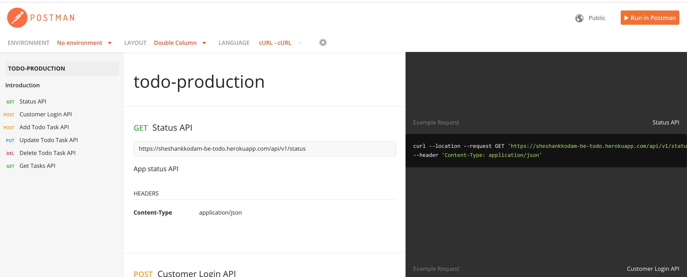

# TODO Backend 
A simple app written in Golang to handle backend operations for to-do list

#### Run locally 
`./run_local.sh`

#### Postman playground
* Open the [API Documentation](https://documenter.getpostman.com/view/1226197/T17AkrKz?version=latest)
* Click on the **Run in Postman** button on the upright corner 
 

 

  

#### Push changes to heroku master
`./push.sh These are my changes`
